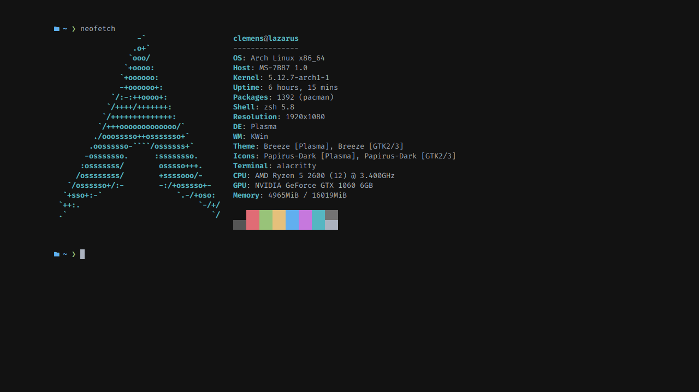
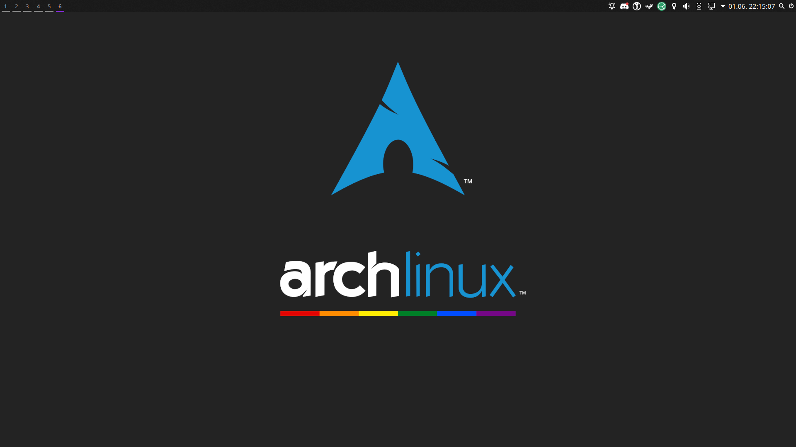
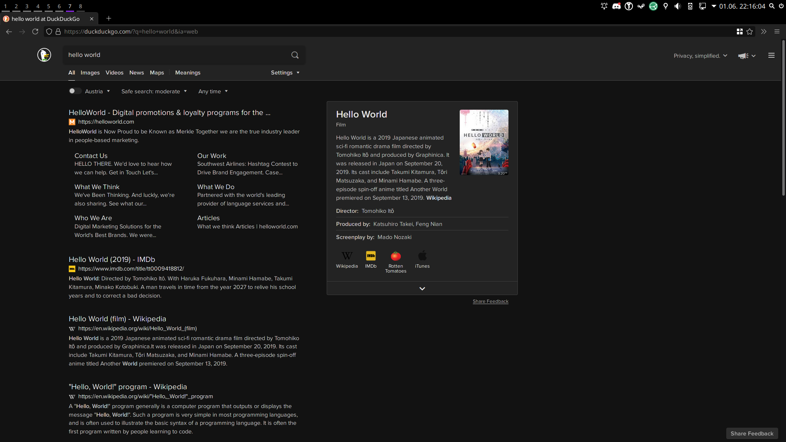
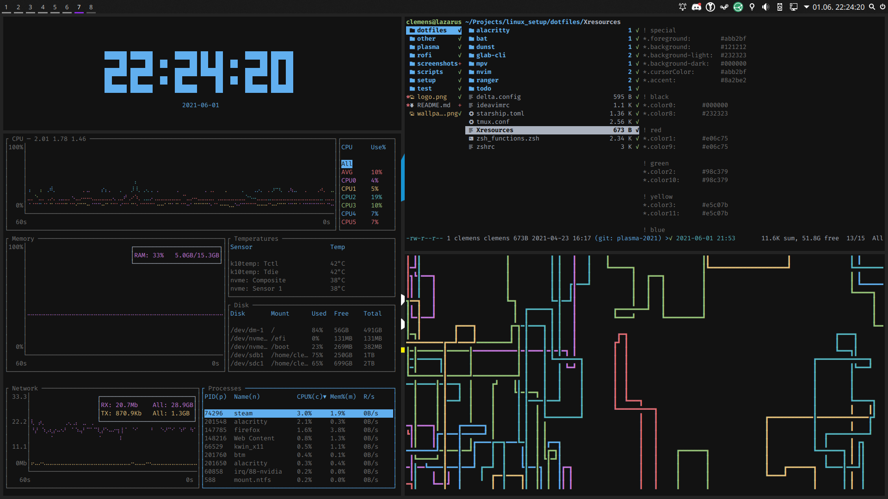
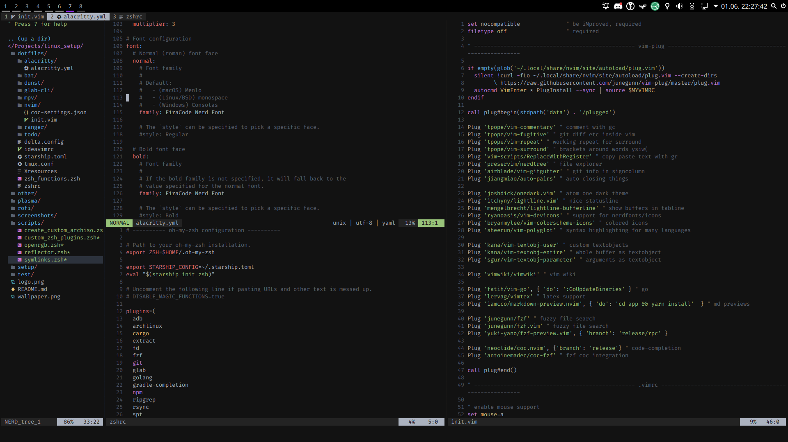

# my ArchLinux setup

## Screenshots

### neofetch

### empty workspace

### single window

### multiple windows

### neovim

## Some tools I use

- Plasma/i3-gaps  
- polybar  
- alacritty  
- neovim  
- firefox  
- fzf  
- ranger  

## What's in this repo?

- `dotfiles`  
  Symlinked dotfiles for all the tools I use.
- `logo.png`  
  btw
- `other`  
  Some file that did'nt really fit into an other folder.
- `polybar`  
  Polybar dotfiles
- `README.md`  
  You are reading this :)
- `rofi`  
  Rofi dotfiles. I use one menu as app launcher and a second menu to select power options (shutdown, reboot, etc.)
- `screenshots`  
  Pretty pictures
- `scripts`  
  Scripts that don't really fit anywhere else.
- `setup`  
  My (way too convoluted) script that installs the system for me.
- `test`  
  Basically a stupid test that check if all pacman packages I want to install during setup actually exist (to prevent typos etc.). When this repo was hosted on gitlab.com I ran this in CI, maybe I will setup a github action for that eventually.

## Why?

I don't know. ¯\\\_(ツ)_/¯
